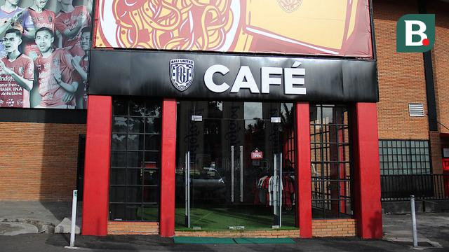
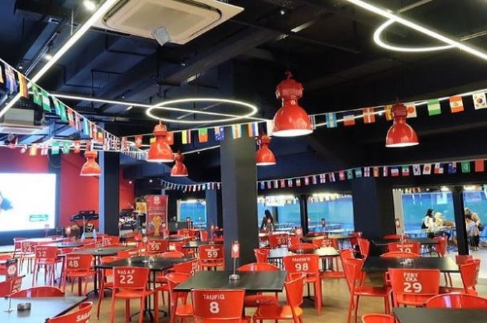
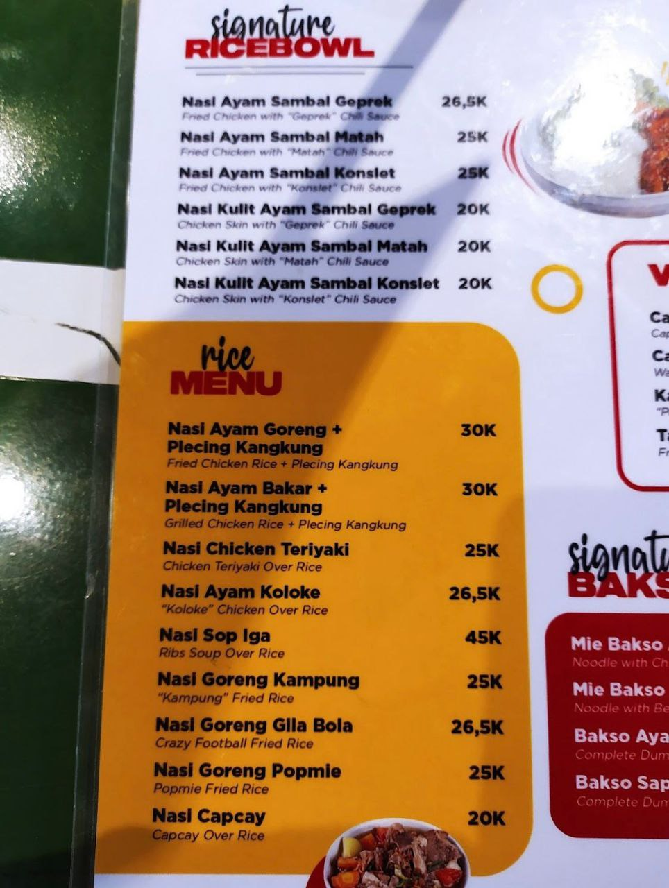
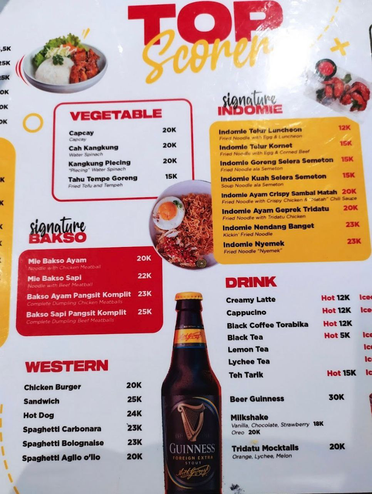

# Bali United Cafe
## ~ Online Restaurant Version ~

### Identitas:

Nama : I Putu Eka Putra Juniawan

NIM : 2205551087

Ini adalah program restoran online berbasis Command Line dimana menu yang ditawarkan adalah menu dari Bali United Cafe Sendiri. 

Project ini bertujuan untuk memenuhi salah satu tugas dari matakuliah Pemrograman Berbasis Objek - Teknologi Informasi - Universitas Udayana - 2023

## Foto Bali United Cafe

## Menu Bali United Cafe

Menu yang ada dalam program ini diambil dari menu asli dari Bali United Cafe, hanya saja cabang dari restaurant dibuat fiktif. 

Restaurant dibuat mempunyai cabang pada daerah-daerah tertentu, tidak hanya di Gianyar saja. 

Menu dari semua restaurant sama. Tetapi dapat ditambahkan maupun dihapus hanya oleh Admin, ketika restaurant satu menunya dihapus ataupun ditambah, otomatis akan berdampak ke cabang restaurant lainnya.

## Alur Kerja program

Ketika program mulai dijalankan, otomatis akan menerima data dari FileRestaurant.txt dan FileMenu.txt sebagai database dari proses running sebelumnya. Sehingga ArrayList dari restaurant dan menu akan terisi data. 

Walaupun demikian, admin dapat memanipulasi data restaurant dan menu seperti menghapus atau menambahnya, dan juga akan berdampak pada data dalam file txt.

Ketika login, user dapat memilih login sebagai Admin atau sebagai Customer. 

### Login Sebagai Admin

Jika melakukan login sebagai Admin, kita harus memasukkan username dan password yang sesuai dalam FileAdmin.txt, jika verifikasi gagal maka user tidak dapat mengakses menu admin.

Jika verifikasi berhasil, maka admin dapat mengakses menu seperti:

~ Lihat daftar restaurant

~ Tambah daftar restaurant

~ Hapus daftar restaurant

~ Lihat menu

~ Tambah menu

~ Hapus menu

### Login Sebagai Customer

Jika melakukan login sebagai Customer, kita harus memasukkan nama dan alamat, sehingga customer dapat mengakses menu seperti:

~ Lihat daftar restaurant

~ Lihat menu restaurant

~ Buat pesanan

~ Lihat riwayat transaksi

## Fitur

Program ini dilengkapi oleh beberapa fitur, diantaranya :

~ Clear Console : untuk menghapus console jika suatu proses dalam program sudah tidak diperlukan.

~ Validasi angka pada rentang tertentu : ketika user dihadapkan pilihan yang hanya berupa angka pada rentang tertentu, user hanya bisa menginputkan angka tersebut, tidak bisa menginputkan karakter selain angka.

~ Validasi angka lebih dari 0 : ketika user dihadapkan pilihan yang hanya berupa angka, misalnya input harga atau jarak, user hanya bisa menginputkan angka, tidak bisa menginputkan karakter selain angka.

~ Validasi restaurant : ketika proses menambah restaurant, admin tidak dapat menginputkan id dan nama restaurant yang sudah ada dalam FileRestaurant.txt, sehingga menghindari duplikasi data.

~ Validasi menu : ketika proses menambah menu, admin tidak dapat menginputkan id dan nama menu yang sudah ada dalam FileMenu.txt, sehingga menghindari duplikasi data.

~ Validasi id restaurant : ketika proses pemesanan makanan, customer hanya bisa mengginputkan id restaurant yang sudah terdaftar, tidak bisa menginputkan hal lain.

~ Ketika proses menambah maupun menghapus baik restaurant atau menu, kita dapat membatalkan proses tersebut dengan menginputkan "0".