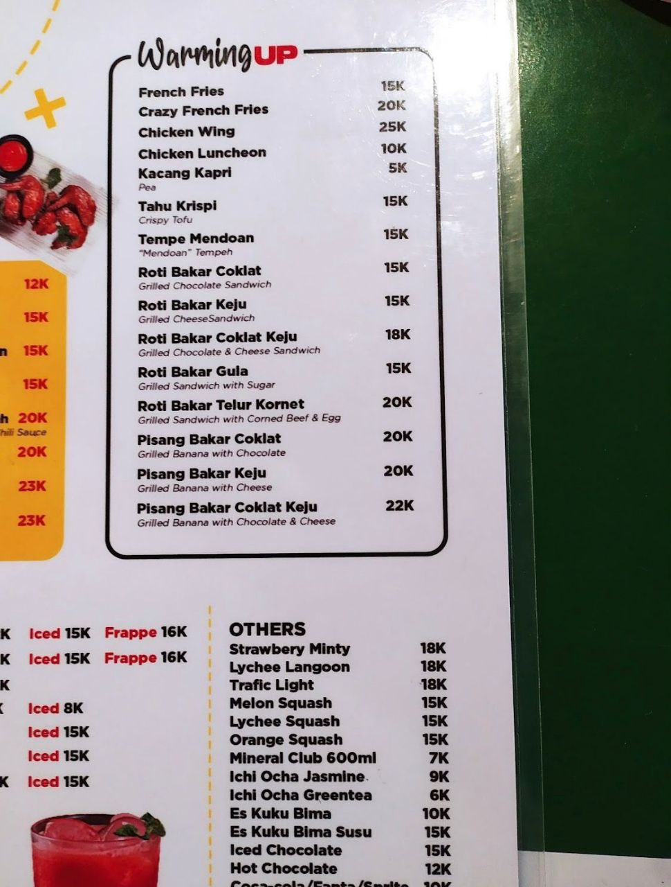
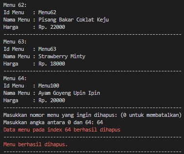
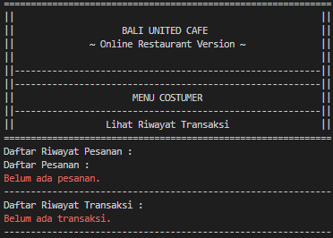

# Bali United Cafe
## ~ Online Restaurant Version ~

### Identitas:

Nama : I Putu Eka Putra Juniawan

NIM : 2205551087

Ini adalah program restoran online berbasis Command Line dimana menu yang ditawarkan adalah menu dari Bali United Cafe Sendiri. 

Project ini bertujuan untuk memenuhi salah satu tugas dari matakuliah Pemrograman Berbasis Objek - Teknologi Informasi - Universitas Udayana - 2023

## Foto Bali United Cafe

## Menu Bali United Cafe

Menu yang ada dalam program ini diambil dari menu asli dari Bali United Cafe, hanya saja cabang dari restaurant dibuat fiktif. 

Restaurant dibuat mempunyai cabang pada daerah-daerah tertentu, tidak hanya di Gianyar saja. 

Menu dari semua restaurant sama. Tetapi dapat ditambahkan maupun dihapus hanya oleh Admin, ketika restaurant satu menunya dihapus ataupun ditambah, otomatis akan berdampak ke cabang restaurant lainnya.

## UML Program

Untuk melihat UML secara lebih jelas, silahkan kunjungi folder uml.

## Alur Kerja program

Ketika program mulai dijalankan, otomatis akan menerima data dari FileRestaurant.txt dan FileMenu.txt sebagai database dari proses running sebelumnya. Sehingga ArrayList dari restaurant dan menu akan terisi data. 

Walaupun demikian, admin dapat memanipulasi data restaurant dan menu seperti menghapus atau menambahnya, dan juga akan berdampak pada data dalam file txt.

Ketika login, user dapat memilih login sebagai Admin atau sebagai Customer. 

 
Pada tampilan awal program, user diminta untuk menginputkan angka 1 (sebagai admin) atau 2 (sebagai customer). Akan dilakukan validasi input hanya angka, dan jika tidak sesuai akan muncul peringatan seperti pada gambar.

### Login Sebagai Admin

Jika melakukan login sebagai Admin, kita harus memasukkan username dan password yang sesuai dalam FileAdmin.txt, jika verifikasi gagal maka user tidak dapat mengakses menu admin.

 
User diminta untuk menginputkan username dan password yang tepat agar dapat login sebagai admin. Jika username atau password tidak sesuai, maka verifikasi gagal.

 
Ini adalah tampilan jika verifikasi admin berhasil dilakukan.

Jika verifikasi berhasil, maka admin dapat mengakses menu seperti:

 
Ini adalah pilihan menu program yang dapat dilakukan oleh admin. Admin hanya dapat menginputkan angkan antara 1 samapai 9 karena akan dilakukan validasi.

~ Lihat daftar restaurant

 
Ini adalah tampilan daftar restaurant yang tersedia.

~ Tambah daftar restaurant

 
Ini adalah tampilan menambahkan daftar restaurant. Jika kita menginputkan id atau nama restaurant yang sudah terdaftar, maka restaurant tidak akan ditambahkan lagi (proses gagal). Jika kita ingin membatalkan menambah restaurant, maka inputkan "0" pada salah satu dari id, nama, atau alamat.

 
Ini adalah tampilan ketika berhasil menambahkan daftar restaurant. 

~ Hapus daftar restaurant

 
Ini adalah tampilan ketika batal menghapus restaurant.

 
Ini adalah tampilan ketika berhasil menghapus restaurant.

~ Lihat menu

 
Ini adalah tampilan melihat menu restaurant.

~ Tambah menu

 
Ini adalah tampilan menambah menu restaurant.

~ Hapus menu

 
Ini adalah tampilan batal menghapus menu restaurant.

 
Ini adalah tampilan berhasil menghapus menu restaurant.

~ Lihat Daftar Pelanggan

 
Ini adalah tampilan lihat daftar pelanggan. Karena program baru dijalankan pada menu admin, maka belum ada pelanggan yang terdaftar.

### Login Sebagai Customer

 
Ini adalah tampilan verifikasi customer.

Jika melakukan login sebagai Customer, kita harus memasukkan nama dan alamat, sehingga customer dapat mengakses menu seperti berikut.

 
Ini adalah tampilan opsi program yang dapat dilakukan oleh customer dan disertai dengan validasi input hanya angka pada rentang 1 ampai 6.

~ Lihat daftar restaurant

 
Hampir sama dengan menu pada admin, user juga dapat melihat daftar restaurant yang tersedia.

~ Lihat menu restaurant

 
Hampir sama dengan menu pada admin, user juga dapat melihat daftar menu yang tersedia.

~ Lihat riwayat transaksi

 
Karena program baru dijalankan dan belum melakukan pemesanan, maka data pesanan dan transaksi belum terisi.

~ Buat pesanan

 
Ketika membuat pesanan, customer diminta untuk menginputkan id restaurant yang terdaftar, jika yang diinputkan tidak sesuai, maka akan muncul peringatan seperti pada gambar. Selanjutnya customer menginputkan jarak dari restaurant ke lokasi customer, tidak lupa disertai dengan validasi angka.

 
Kemudian akan ditampilkan menu yang tersedia dan customer memilih menu yang ingin dibeli dan jumlah pesanan, disertai dengan validasi angka. Jika sudah selesai memilih menu, customer dapat memasukkan angka 0. Semua menu yang customer pesan beserta total harga akan ditampilkan.

 
Customer menginputkan jumlah uang, akan dilakukan validasi jika jumlah uang kurang dari total harga, akan muncul peringatan.

 
Ini adalah tampilan ketika customer berhasil melakukan pembayaran. Dilengkapi dengan waktu pemesanan, id restaurant, nama pelanggan, alamat pelanggan, jarak ke restaurant, daftar menu yang dipesan, total harga, jumlah uang yang dibayar, beserta jumlah kembalian.

 
Ini adalah tampilan riwayat transaksi yang pernah dilakukan oleh customer.

~ Mencoba membuat pesanan kembali

 
Misalkan customer memilih restaurant lain yaitu id BU02.

 
Customer memilih menu seperti pada gambar.

 
Customer melakukan pembayaran seperti pada gambar.

 
Maka pada tampilan riwayat transaksi, akan ditampilkan menu apa saja yang pernah dipesan oleh customer, serta berapa kali pernah melakukan pembayaran. Riwayat transaksi ini adalah total dari semua pesanan yang pernah dilakukan.

 
Ini adalah tampilan pada user atau customer ketika memilih keluar dari program.

## Fitur

Program ini dilengkapi oleh beberapa fitur, diantaranya :

~ Clear Console : untuk menghapus console jika suatu proses dalam program sudah tidak diperlukan.

~ Validasi angka pada rentang tertentu : ketika user dihadapkan pilihan yang hanya berupa angka pada rentang tertentu, user hanya bisa menginputkan angka tersebut, tidak bisa menginputkan karakter selain angka.

~ Validasi angka lebih dari 0 : ketika user dihadapkan pilihan yang hanya berupa angka, misalnya input harga atau jarak, user hanya bisa menginputkan angka, tidak bisa menginputkan karakter selain angka.

~ Validasi restaurant : ketika proses menambah restaurant, admin tidak dapat menginputkan id dan nama restaurant yang sudah ada dalam FileRestaurant.txt, sehingga menghindari duplikasi data.

~ Validasi menu : ketika proses menambah menu, admin tidak dapat menginputkan id dan nama menu yang sudah ada dalam FileMenu.txt, sehingga menghindari duplikasi data.

~ Validasi id restaurant : ketika proses pemesanan makanan, customer hanya bisa mengginputkan id restaurant yang sudah terdaftar, tidak bisa menginputkan hal lain.

~ Ketika proses menambah maupun menghapus baik restaurant atau menu, kita dapat membatalkan proses tersebut dengan menginputkan "0".

## Sekian dan Terimakasih